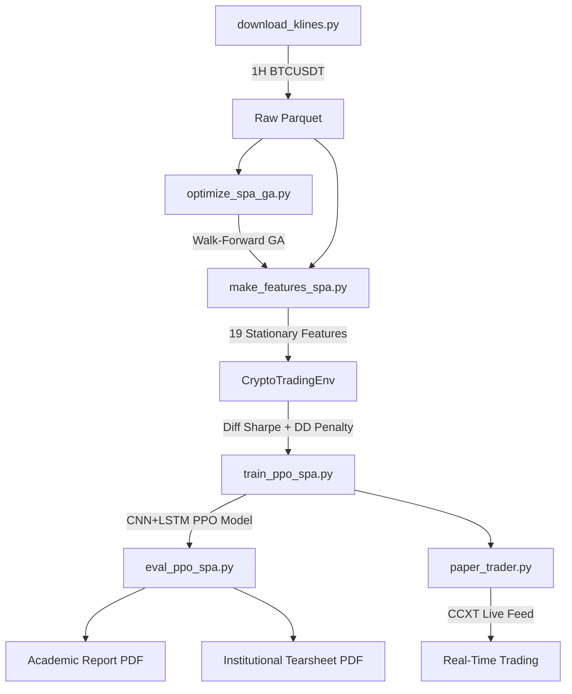

# Automated Trading using AI (Institutional Edition)

**Project Status:** 🏰 Institutional-Grade | **Timeframe:** 1H | **Algorithm:** CNN+LSTM PPO + SPA

An end-to-end Deep Reinforcement Learning pipeline for automated crypto day trading. Designed to generate statistically proven, idiosyncratic Alpha and survive hedge fund due diligence.

## 🧠 Core Architecture



### 🧬 Neural Network: CNN + LSTM Feature Extractor
| Layer | Purpose |
|---|---|
| Conv1D × 2 (k=3, 64ch) | Extract local 3-bar candlestick patterns |
| LSTM × 2 (128 hidden) | Capture temporal regimes & trend persistence |
| LayerNorm + Dropout(0.1) | Prevent overfitting on noisy crypto data |
| Orthogonal Init | PPO convergence stability (Andrychowicz 2020) |

### 📊 Feature Engineering (19 Features, All Stationary)
- **Returns:** `log_ret_1`, `momentum_5/10/24`
- **Volatility:** `rvol_20/50`, `vol_regime`, `ATR_pct`, `BB_width/position`
- **Momentum:** `RSI_14` [-1,1], `MACD_norm`, `close_z_60`, `stoch_k/d` [-1,1]
- **Volume:** `vol_ratio`, `vol_direction`
- **SPA:** `spa_sig` {-1,0,1}, `spa_dist` (normalized boundary distance)

### 🛡️ Environment Design
- **Reward:** Differential Sharpe Ratio (Moody & Saffell 1998)
- **Drawdown:** Quadratic penalty > 2%, liquidation at -50%
- **Account State:** 5-dim (pos_frac, unrealized_pct, free_margin, drawdown, steps_since_trade)
- **Fees/Slippage:** 0.05% taker + volatility-scaled slippage

### 📋 Dual Evaluation Suite
| Report | Audience | Contents |
|---|---|---|
| Academic Report | Thesis Committee | Agent vs B&H, Monthly Heatmap, Train/Test Sharpe |
| Institutional Tearsheet | Hedge Fund DD | VaR/CVaR, Monte Carlo p-value, Alpha-Beta, Capacity |

---

## 📁 Project Structure

```
src/
├── data_ingest/    # Binance API downloader
├── features/       # 19-feature stationary pipeline + stationarity audit
├── optimize/       # Walk-Forward Validated GA for SPA parameters
├── spa/            # Self-Adjusting Price Action core math
├── models/         # CNN+LSTM custom PyTorch architecture
├── rl_env/         # CryptoTradingEnv (Diff Sharpe, DD penalty, liquidation)
├── train/          # PPO training orchestrator
├── eval/           # Academic Report + Institutional Tearsheet
├── live/           # Production paper trader (CCXT + real-time inference)
└── dashboard/      # Streamlit dashboard (WIP)
```

---

## 🚀 How to Run

### 1. Download Data
```bash
python src/data_ingest/download_klines.py \
    --pair BTCUSDT --start 2022-01-01 --end 2024-12-31 \
    --interval 1h --output data/raw/btc_1h.parquet
```

### 2. Optimize SPA (Walk-Forward GA)
```bash
python src/optimize/optimize_spa_ga.py --input data/raw/btc_1h.parquet
```

### 3. Generate Features
```bash
python src/features/make_features_spa.py \
    --input data/raw/btc_1h.parquet --output data/features/btc_1h_spa.parquet
```

### 4. Train (H100 Cluster)
```bash
sbatch train_ppo_spa.sh
```

### 5. Evaluate (Academic + Institutional)
```bash
python src/eval/eval_ppo_spa.py \
    --model data/models/ppo_spa_btc_1h.zip \
    --features data/features/btc_1h_spa.parquet \
    --out_dir data/eval
```
Outputs: `data/eval/reports/academic_report.pdf` + `data/eval/institutional_tearsheet.pdf`

### 6. Live Paper Trading
```bash
python src/live/paper_trader.py \
    --model data/models/ppo_spa_btc_1h.zip \
    --meta data/features/btc_1h_spa_meta.json \
    --symbol BTC/USDT --interval 3600
```

---

## 🛠️ Setup
```bash
python -m venv .venv && .\.venv\Scripts\activate
pip install -r requirements.txt
```